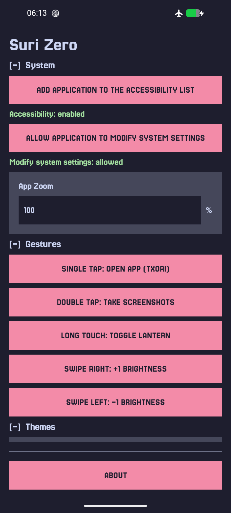
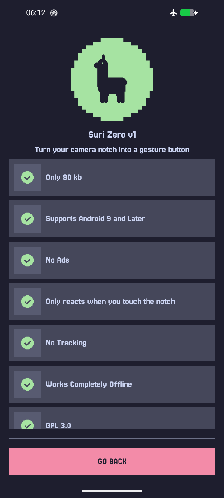

# Suri Zero

**Turn your camera notch into a gesture button.**

| Home | About |
| - | - |
|  |  |

> This app prioritizes stability. It has already reached maturity and is no longer accepting pull requests.

---

## Installation

  
  &nbsp;
  

